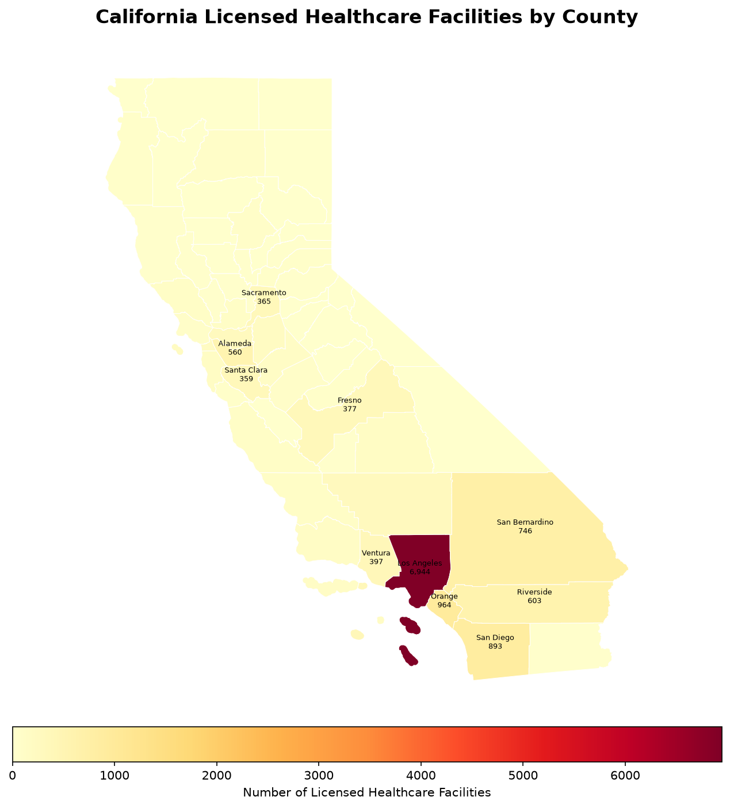
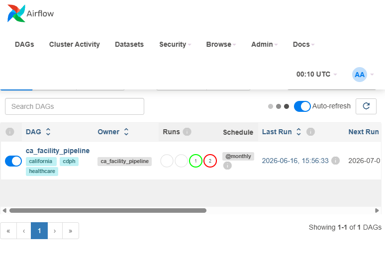

=Let's create it. Run this in PowerShell:

```
code C:\Users\sushm\ca_facility_pipeline\README.md
```

A new blank README.md will open in VS Code. Paste this entire content:

```markdown
# California Healthcare Facility Licensing Data Pipeline

An end-to-end data engineering pipeline ingesting California's licensed
healthcare facility data from the CDPH Open Data portal into a
query-ready PostgreSQL warehouse — with dbt models, PySpark transforms,
Airflow orchestration, and a GeoPandas map.

**Data source:** California Department of Public Health (CDPH) —
Licensed and Certified Healthcare Facility Listing, updated monthly.

---

## Architecture

```
CDPH Open Data (CSV)
        │
        ▼
  [ Ingestion ]          Python + requests
  Download CSVs          runs monthly via Airflow
        │
        ▼
  [ Raw Layer ]          PostgreSQL
  raw_facility_locations
  raw_across_time_summary
        │
        ▼
  [ Transform ]          PySpark
  Clean, deduplicate,
  standardize counties
        │
        ▼
  [ dbt Models ]         dbt + PostgreSQL
  stg_facilities
  mart_facility_access
        │
        ▼
  [ Serve ]              GeoPandas + Power BI
  County Map + Dashboard
```

---

## Tech Stack

| Tool | Purpose |
|------|---------|
| Python | Ingestion scripts |
| PostgreSQL | Data warehouse |
| PySpark | Large scale transformation |
| dbt | Data modeling + testing |
| Airflow | Pipeline orchestration |
| Docker | Containerized Airflow |
| GeoPandas | California county map |
| Power BI | Dashboard |

---

## Key Findings

- **15,508** licensed healthcare facilities across California
- **Los Angeles County** holds 45% of all state facilities (6,944)
- Pipeline runs automatically every month via Airflow
- All 58 California counties mapped and analyzed

---

## Screenshots

### California Healthcare Facility Map


### dbt Lineage Graph


### Airflow DAG


---

## Setup

### 1. Clone the repo
```bash
git clone https://github.com/sushmitha5525-R/ca-facility-pipeline.git
cd ca-facility-pipeline
```

### 2. Create virtual environment
```bash
py -3.13 -m venv venv313
venv313\Scripts\activate
pip install -r requirements.txt
```

### 3. Set up PostgreSQL
```bash
psql -U postgres
CREATE DATABASE ca_facility_db;
\q
```

### 4. Configure .env
```bash
cp .env.example .env
# Add your PostgreSQL password
```

### 5. Run the pipeline
```bash
py run_day1.py
```

---

## Project Structure

```
ca_facility_pipeline/
├── config/              # Settings and environment config
├── ingestion/           # Download and load scripts
├── spark/               # PySpark transformation
├── ca_facility_dbt/     # dbt models and tests
├── airflow/             # Airflow DAG
├── geomap/              # GeoPandas map script
├── screenshots/         # Project screenshots
└── README.md
```

---

*Built as a portfolio project targeting state government data engineering roles.*
```

